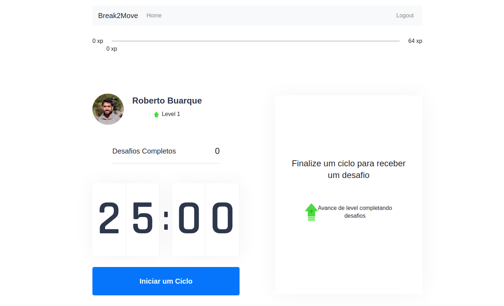

<h1 align="center">
  Break2Move
</h1>

  <a href="#-tecnologias">Technologies</a>&nbsp;&nbsp;&nbsp;|&nbsp;&nbsp;&nbsp;
  <a href="#-projeto">Project</a>&nbsp;&nbsp;&nbsp;|&nbsp;&nbsp;&nbsp;
  <a href="#-layout">Layout</a>&nbsp;&nbsp;&nbsp;|&nbsp;&nbsp;&nbsp;
  <a href="#-como-executar">How to execute</a>&nbsp;&nbsp;&nbsp;|&nbsp;&nbsp;&nbsp;
  <a href="#-licença">License</a>

  

 

 

  

## ✨ Technologies

This project was developed using the following frontend technologies:

- [React](https://reactjs.org)
- [Next.js](https://nextjs.org/)
- [TypeScript](https://www.typescriptlang.org/)
- [Axios](https://github.com/axios/axios)

The backend project is acessible in the following repository:
- [Backend](https://github.com/robertoassuncaofilho/break2moveapi)

## 💻 Project

Break2Move is an app that puts together the Pomodoro technique and healthy exercises for anyone who stays in front of the computer for a long time.
Developed during the [Rocketseat](https://rocketseat.com.br/) Next Level Week #4 bootcamp and incremented with a backend, login and registration functionalities by [Roberto Buarque](https://www.linkedin.com/in/roberto-assuncao-filho/).

## 🔖 Access

You can access the hosted project at [this link](https://break2move.robertobuarque.com)

## 🚀 How to execute

- Clone the repository
- Install dependencies using `yarn` or `npm install`
- Start the server with `yarn dev` or `npm run dev`

Now you can access [localhost:3000](http://localhost:3000) from your browser.

## 📄 License

This project is under MIT license. See the file [LICENSE](LICENSE.md) to check the details.
